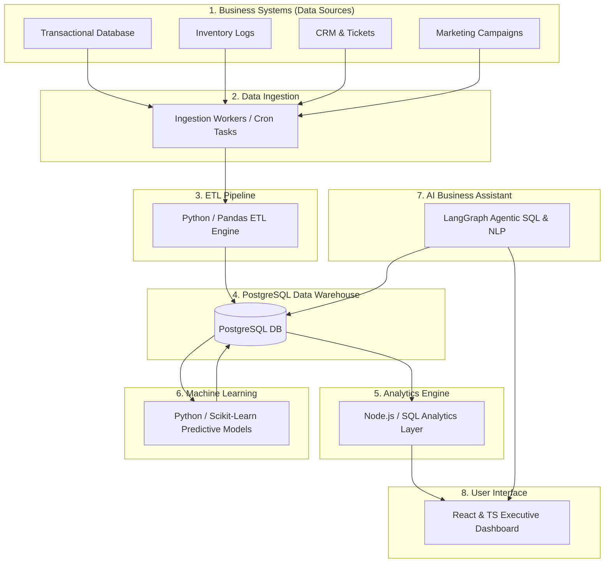

# System Architecture Overview

This document details the high-level architecture of the **Enterprise AI Decision Intelligence Platform**. The platform is designed for scalability, modularity, and rapid analytical processing, transforming raw transactional records into real-time business intelligence.

---

## Architectural Data Flow

---

## Architectural Modules Explained

### 1. Business Systems (Data Sources)
- **Purpose:** Represents the systems of record where business events occur.
- **Details:** Includes the transactional checkout systems, warehouse physical inventory monitors, shipping carrier APIs, marketing engines, and customer support helpdesks. These generate raw data in various formats (CSV, JSON, SQL logs).

### 2. Data Ingestion
- **Purpose:** Collects raw datasets from business systems and deposits them into a raw landing zone.
- **Details:** Consists of ingestion scripts that poll transactional databases, download flat files, and aggregate logs into the `/datasets` directory. This decouples downstream processing from live transactional systems.

### 3. ETL Pipeline
- **Purpose:** Cleans, refines, and formats raw files into structural, relational data models.
- **Details:** Driven by Python, Pandas, and SQLAlchemy. Performs data validations (e.g., matching IDs, checking nulls, casting dates), computes pre-aggregated figures, and pushes validated records into the analytical tables of the database.

### 4. PostgreSQL Data Warehouse
- **Purpose:** Serves as the single source of truth for both historic and real-time decision metrics.
- **Details:** Configured using a star schema, containing central fact tables (orders, support logs, campaign clicks) surrounded by dimension tables (customers, products, warehouses, calendar dates). Includes indexes and foreign key constraints for fast query execution.

### 5. Analytics Engine
- **Purpose:** Powers standard KPIs, business reports, and charts via REST endpoints.
- **Details:** Built on Node.js and Express.js. Directly executes optimized SQL queries on the data warehouse to serve metrics such as monthly revenue, regional delivery times, sales trends, and inventory counts.

### 6. Machine Learning
- **Purpose:** Provides predictive capabilities to transform retrospective data into forward-looking decisions.
- **Details:** Uses Scikit-learn and XGBoost. Runs periodically to train models on historical sales and inventory. Computes predictions (e.g., demand forecasting, churn risk, ticket priority) and saves these insights directly back to the database for retrieval by the dashboard or LLM.

### 7. AI Business Assistant
- **Purpose:** Provides a conversational interface to the business database.
- **Details:** An agentic assistant built using LangGraph. It interprets raw text requests (e.g., *"Which customer type generated the most profit in Delhi last month?"*), translates them safely into PostgreSQL SQL queries, executes the query, reads the returned data, and generates a conversational markdown response.

### 8. Executive Dashboard
- **Purpose:** Visualizes business performance and hosts the AI chat interface.
- **Details:** A responsive web application built with React, TypeScript, and Tailwind CSS. It connects to the Node.js backend to display interactive charts, metrics, and has a dedicated drawer/window for the AI Business Assistant chat.