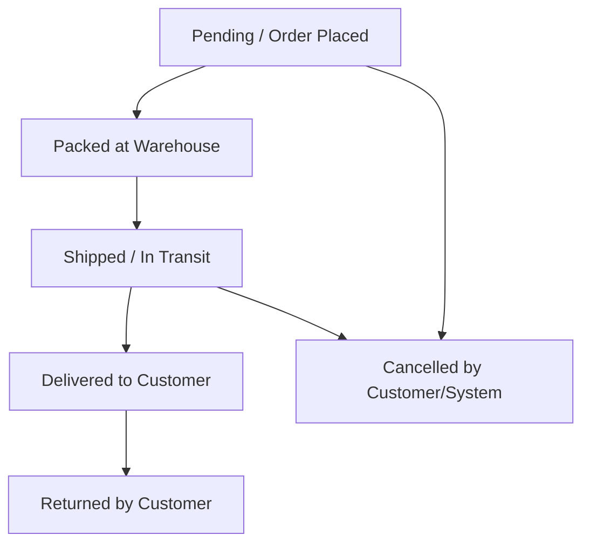

# Business Model & Operations: NovaMart

## Company Profile
- **Company Name:** NovaMart
- **Industry:** E-Commerce (B2C & B2B)
- **Business Model:** Omni-channel digital retail powered by automated regional warehouses and AI-driven supply chain coordination.
- **Value Proposition:** Providing high-quality electronics, fashion, furniture, and appliances at competitive prices with rapid fulfillment, flexible payment structures, and elite customer tiering.

---

## Operating Matrix

### Product Segments
NovaMart manages thousands of stock-keeping units (SKUs) across four major product categories:
1. **Electronics:** Smart devices, laptops, mobile phones, audio accessories, and wearables (high margin, sensitive supply chain).
2. **Fashion:** Apparel, footwear, jewelry, and activewear (highly seasonal, high return rates).
3. **Furniture:** Living room set, bedroom items, office desks, and storage units (heavy bulk shipping, low inventory turnover).
4. **Home Appliances:** Refrigerators, washing machines, microwaves, and air conditioners (high value, requires shipping tracking and installation coordination).

### Geographic Footprint & Logistics Hubs
NovaMart operates in major urban clusters, leveraging strategic warehousing to minimize shipment latency:
- **Operating Cities:**
  - Hyderabad
  - Bangalore
  - Chennai
  - Mumbai
  - Delhi
- **Fulfillment Centers (Warehouses):**
  - **Hyderabad Warehouse:** Serves Hyderabad and Chennai regions.
  - **Bangalore Warehouse:** Serves Bangalore and Southern peninsula.
  - **Mumbai Warehouse:** Serves Mumbai, Delhi, and Western corridors.

---

## Customer Segments
NovaMart structures its sales and support around three distinct customer profiles:
* **Regular:** Standard retail consumers. Pay full pricing, standard delivery speed, and standard customer support priority.
* **Premium:** Subscription-based members (e.g., NovaPrime). Benefit from free shipping, exclusive seasonal discounts, and expedited support queues.
* **Business:** Wholesale or corporate buyers. Order in bulk, receive custom volume discounts, pay via net-banking invoice structures, and require dedicated account manager services.

---

## Financial & Transaction Flow

### Payment Methods
To maximize conversion, NovaMart supports a variety of modern and traditional digital payment pathways:
- **UPI (Unified Payments Interface):** Instant, low-cost mobile payments.
- **Credit Card:** High-security payment with credit lines.
- **Debit Card:** Direct bank account transfers.
- **Net Banking:** Primarily utilized by Business accounts for high-value transactional invoices.
- **Cash on Delivery (COD):** Crucial for building trust in emerging retail segments, necessitating return-risk tracking.

### Lifecycle of an Order
Orders flow through a deterministic transactional pipeline to ensure accurate state tracking and accounting:

- **Pending:** Order placed by the customer; payment authorized or COD flagged.
- **Packed:** Item retrieved, quality-checked, and packaged at the assigned warehouse.
- **Shipped:** Handed over to logistics partners, tracking ID generated.
- **Delivered:** Order received by customer, payment settled.
- **Cancelled:** Cancelled prior to delivery (refund triggered if prepaid).
- **Returned:** Product returned within the return window (typically fashion/electronics) due to fit, damage, or preference.
